# Cодержание

### Часть 1: Классы и модификаторы доступа

* #### [Задание 1.1: Банковский счёт](#title0)

* #### [Задание 1.2: Модификаторы доступа — анализ и исправление](#title1)

* #### [Задание 1.3: Ключевое слово var](#title2)

### Часть 2: Абстрактные классы, Sealed-классы и интерфейсы

* #### [Задание 2.1: Иерархия сотрудников](#title3)

* #### [Задание 2.2: Sealed-интерфейс — система оплаты](#title4)

* #### [Задание 2.3: Интерфейсы — default, static и private методы](#title41)

* #### [Задание 2.4: Абстрактный класс vs Интерфейс](#title42)

### Часть 3: Массивы

* #### [Задание 3.1: Операции с матрицами](#title5)

* #### [Задание 3.2: Зубчатый массив — журнал оценок](#title6)

### Часть 4: Строки и StringBuilder

* #### [Задание 4.1: Анализатор текста](#title7)

* #### [Задание 4.2: String Pool — исследование](#title8)

### Часть 5: Records, Enums, EnumSet и EnumMap

* #### [Задание 5.1: Система оценок](#title9)

* #### [Задание 5.2: Record с бизнес-логикой и Enum с абстрактным методом](#title10)

### Часть 6: Аннотации

* #### [Задание 6.1: Собственная аннотация + обработка через Reflection](#title11)

### Часть 7: Анонимные классы, локальные классы, лямбды и ссылки на методы

* #### [Задание 7.1: Эволюция кода — от анонимного класса к ссылке на метод](#title12)

* #### [Задание 7.2: Конвейер обработки данных (Stream API)](#title13)

* #### [Задание 7.3: Композиция функций и локальный класс](#title14)

### Часть 8: Интеграционное задание

* #### [Задание 8.1: Система управления библиотекой](#title15)

<br>
<br>

---

## Часть 1: Классы и модификаторы доступа

### <a id="title0">Задание 1.1: Банковский счёт</a>

Напишите класс BankAccount с нуля. Вам даны только метод main и ожидаемый вывод. Вы должны самостоятельно спроектировать и реализовать весь класс.

Требования к классу BankAccount:

1. Приватные поля экземпляра: owner (String), balance (double), accountNumber (String)

2. Приватное статическое поле totalAccounts (int) — общий счётчик всех созданных счетов

3. Приватное статическое поле bankName (String) — название банка, общее для всех счетов

4. Статический блок инициализации: устанавливает bankName = "Java Bank" и выводит "Банковская система инициализирована"

5. Блок инициализации экземпляра: увеличивает totalAccounts и выводит "Создание счёта #" + totalAccounts

6. Конструктор BankAccount(String owner, double initialBalance) — генерирует accountNumber в формате "ACC-" + totalAccounts (например, "ACC-1")

7. Метод deposit(double amount) — увеличивает баланс; если amount <= 0 — выводит "Ошибка: сумма должна быть положительной" и не изменяет баланс

8. Метод withdraw(double amount) — уменьшает баланс; если средств недостаточно — выводит "Ошибка: недостаточно средств" и не изменяет баланс

9. Статический метод getTotalAccounts() — возвращает количество созданных счетов

10. Переопределённый toString() — возвращает строку в формате "[ACC-1] Алиса: 1500.00 руб."

```
public class BankAccount {

    // Напишите весь класс самостоятельно

    public static void main(String[] args) {
        BankAccount a1 = new BankAccount("Алиса", 1000);
        BankAccount a2 = new BankAccount("Борис", 500);

        System.out.println(a1);
        System.out.println(a2);

        a1.deposit(500);
        System.out.println("После пополнения: " + a1);

        a1.withdraw(200);
        System.out.println("После снятия: " + a1);

        a1.withdraw(5000);

        a2.deposit(-100);

        System.out.println("Всего счетов: " + BankAccount.getTotalAccounts());
    }
}
```

Ожидаемый вывод:

```
Банковская система инициализирована
Создание счёта #1
Создание счёта #2
[ACC-1] Алиса: 1000.00 руб.
[ACC-2] Борис: 500.00 руб.
После пополнения: [ACC-1] Алиса: 1500.00 руб.
После снятия: [ACC-1] Алиса: 1300.00 руб.
Ошибка: недостаточно средств
Ошибка: сумма должна быть положительной
Всего счетов: 2
```

#### Решение

```
package practice_2;

public class BankAccount {
    private String owner;
    private double balance;
    private String accountNumber;

    private static int totalAccounts; // общий счётчик всех созданных счетов
    private static String bankName; // название банка, общее для всех счетов

    // статический блок
    static {
        bankName = "Java Bank";
        System.out.println("Банковская система инициализирована");
    }

    // блок инициализации
    {
        ++totalAccounts;
        System.out.println("Создание счёта #" + totalAccounts);
    }

    // конструктор
    BankAccount(String owner, double initialBalance) {
        this.owner = owner;
        this.balance = initialBalance;
        this.accountNumber = "ACC-" + String.valueOf(totalAccounts);
    }

    // увеличивает баланс
    void deposit(double amount){
        if (amount <= 0){
            System.out.println("Ошибка: сумма должна быть положительной");
        } else{
            this.balance += amount;
        }
    }

    // уменьшает баланс
    void withdraw(double amount){
        if (this.balance - amount <= 0){
            System.out.println("Ошибка: недостаточно средств");
        } else{
            this.balance -= amount;
        }
    }

    // возвращает количество созданных счетов
    static int getTotalAccounts() {
        return totalAccounts;
    }

    @Override
    public String toString() {
        return '[' + accountNumber + ']' +
                " " + owner + ": " +
                String.format("%.2f", balance) + " руб.";
    }

    public static void main(String[] args) {
        BankAccount a1 = new BankAccount("Алиса", 1000);
        BankAccount a2 = new BankAccount("Борис", 500);

        System.out.println(a1);
        System.out.println(a2);

        a1.deposit(500);
        System.out.println("После пополнения: " + a1);

        a1.withdraw(200);
        System.out.println("После снятия: " + a1);

        a1.withdraw(5000);

        a2.deposit(-100);

        System.out.println("Всего счетов: " + BankAccount.getTotalAccounts());
    }
}
```

<details>
    <summary>result</summary>
    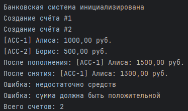
</details>

<br>

### <a id="title1">Задание 1.2: Модификаторы доступа — анализ и исправление</a>

Дан следующий код с двумя классами, которые находятся в разных пакетах. Внимательно изучите код, затем ответьте на вопросы и выполните задания.

```
package company.core;

public class Employee {
    public String name;
    protected int age;
    double salary;              // какой модификатор?
    private String password;

    public Employee(String name, int age, double salary, String password) {
        this.name = name;
        this.age = age;
        this.salary = salary;
        this.password = password;
    }

    public String getRole() {
        return "Employee";
    }

    protected void promote(double raise) {
        this.salary += raise;
    }

    void printSummary() {
        System.out.println(name + ", " + age + " лет, " + salary + " руб.");
    }

    private boolean validatePassword(String input) {
        return password.equals(input);
    }
}

```

```
package company.app;

import company.core.Employee;

public class HRSystem {
    public static void main(String[] args) {
        Employee emp = new Employee("Иван", 30, 80000, "secret");

        System.out.println(emp.name);            // Строка A
        System.out.println(emp.age);             // Строка B
        System.out.println(emp.salary);          // Строка C
        System.out.println(emp.password);        // Строка D
        System.out.println(emp.getRole());       // Строка E
        emp.promote(5000);                       // Строка F
        emp.printSummary();                      // Строка G
        emp.validatePassword("secret");          // Строка H
    }
}

```

<details>
    <summary>error</summary>
    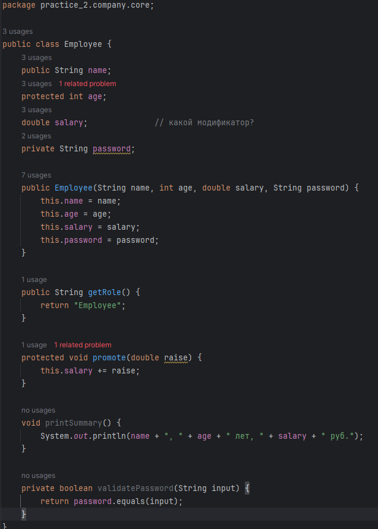
    <br>
    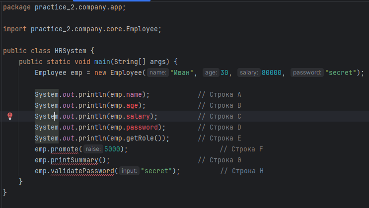
     <br>
    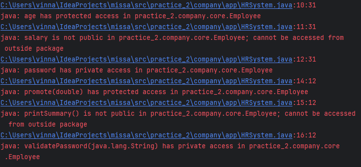
</details>

#### Решение

```
1-2. Для каждой строки (A–H) определите: скомпилируется ли она? Если нет — укажите причину (модификатор + пакет).
```

* double salary модификатор default.

* A = да = доступен везде.

* B = нет = модификатор protected доступен в том же пакете или в классах наследниках в других пакетах.

* С = нет = модификатор default доступен только в этом пакете.

* D = нет = модификатор private внутри класса доступен.

* Е = да = это геттер, имеет модификатор public = доступен везде.

* F = нет = модификатор protected доступен в том же пакете или в классах наследниках в других пакетах.

* G = нет = модификатор default доступен только в этом пакете.

* H = нет = модификатор private внутри класса доступен.

```
3. Создайте файл EmployeeFixed.java. Перепишите класс Employee с правильной инкапсуляцией:

* Все поля должны быть private

* Добавьте геттеры для name, age, salary (но не для password)

* Метод promote() должен быть public

* Метод printSummary() должен быть public

* Метод validatePassword() остаётся private, но добавьте публичный метод authenticate(String input), который вызывает validatePassword() внутри
```

#### Решение

```
package practice_2.task_1_2.company.core;

public class EmployeeFixed {
    private String name;
    private int age;
    private double salary;
    private String password;

    public EmployeeFixed(String name, int age, double salary, String password) {
        this.name = name;
        this.age = age;
        this.salary = salary;
        this.password = password;
    }

    public String getName() {
        return name;
    }

    public int getAge() {
        return age;
    }

    public double getSalary() {
        return salary;
    }

    public String getRole() {
        return "Employee";
    }

    public void promote(double raise) {
        this.salary += raise;
    }

    public void printSummary() {
        System.out.println(name + ", " + age + " years, " + salary + " rub.");
    }

    private boolean validatePassword(String input) {
        return password.equals(input);
    }

    public void authenticate(String input){
        validatePassword(input);
    }
}
```

```
package practice_2.task_1_2.company.app;

import practice_2.task_1_2.company.core.EmployeeFixed;

public class HRSystem {
    public static void main(String[] args) {
        EmployeeFixed emp = new EmployeeFixed("Ivan", 30, 80000, "secret");

        System.out.println(emp.getName());            // Строка A
        System.out.println(emp.getAge());             // Строка B
        System.out.println(emp.getSalary());          // Строка C
        //System.out.println(emp.password);        // Строка D
        System.out.println(emp.getRole());       // Строка E
        emp.promote(5000);                       // Строка F
        emp.printSummary();                      // Строка G
        emp.authenticate("secret");          // Строка H вместо validatePassword
    }
}
```

<details>
    <summary>error</summary>
    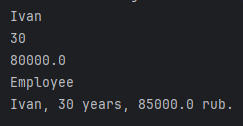
</details>

<br>

### <a id="title2">Задание 1.3: Ключевое слово var</a>

Напишите файл VarDemo.java, который демонстрирует возможности и ограничения var.

Требования:

1. Напишите 5 примеров, где var работает корректно (с разными типами: int, String, ArrayList, массив, ваш собственный объект). После каждого примера выведите getClass().getSimpleName() для проверки типа.

2. В комментариях после блока рабочего кода напишите 4 примера, где var не компилируется, с объяснением почему:

* var без инициализации

* var как параметр метода

* var как поле класса

* var с null

```
public class VarDemo {
    // var field = 10; // Не компилируется — var нельзя использовать для полей класса

    public static void main(String[] args) {
        // Напишите 5 рабочих примеров с var
        // Для каждого выведите тип через getClass().getSimpleName()

        // Затем в комментариях покажите 4 случая, где var не работает
    }
}
```

Ожидаемый вывод (примерный):

```
42 -> Integer
Java -> String
[один, два] -> ArrayList
[1, 2, 3] -> int[]
BankAccount -> BankAccount
```

#### Решение

<details>
    <summary>result</summary>
    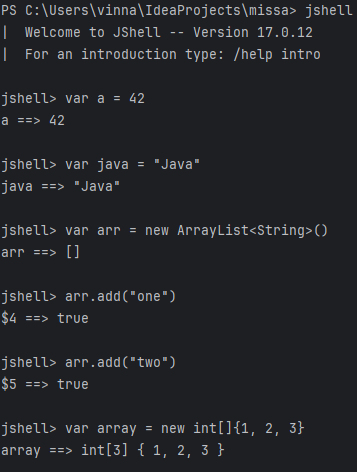
    <br>
    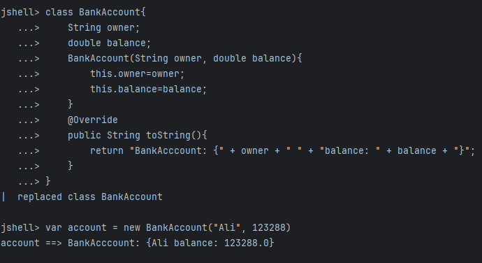
    <br>
    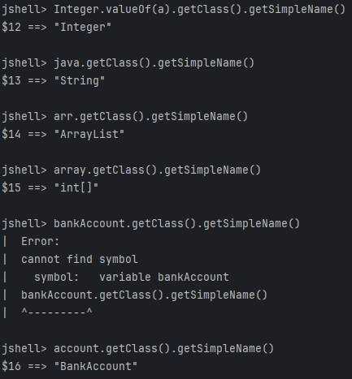
</details>

<br>
<br>

---

## Часть 2: Абстрактные классы, Sealed-классы и интерфейсы

### <a id="title3">Задание 2.1: Иерархия сотрудников</a>

Спроектируйте и реализуйте систему расчёта бонусов сотрудников. Напишите весь код с нуля. Вам дан только метод main и ожидаемый вывод.

Требования:

Абстрактный класс Employee:

1. Поля: name (protected), baseSalary (protected)

* Конструктор, геттеры

* Абстрактный метод double calculateBonus()

* Обычный метод double totalCompensation() — возвращает baseSalary + calculateBonus()

* Переопределённый toString() — формат: "Имя | Оклад: X | Бонус: Y | Итого: Z" (все суммы с .0)

* Класс Manager extends Employee:

2. Дополнительное поле: teamSize (int)

* Бонус = baseSalary * 0.15 + teamSize * 5000

* Класс Developer extends Employee:

3. Дополнительное поле: language (String)

* Бонус = baseSalary * 0.12

4. Класс Intern extends Employee:

* Бонус = фиксированные 10000

```
public class EmployeeBonus {
    public static void main(String[] args) {
        Employee[] team = {
            new Manager("Ольга", 120000, 5),
            new Developer("Андрей", 95000, "Java"),
            new Developer("Мария", 100000, "Python"),
            new Intern("Стажёр Петя", 30000)
        };

        System.out.println("=== Расчёт бонусов ===");
        double totalBudget = 0;
        for (Employee e : team) {
            System.out.println(e);
            totalBudget += e.totalCompensation();
        }
        System.out.printf("\nОбщий бюджет: %.0f руб.%n", totalBudget);
    }
}
```

#### Решение

```
package practice_2;

public abstract class Employee {
    protected String name;
    protected double baseSalary;

    public Employee(String name, double baseSalary) {
        this.name=name;
        this.baseSalary=baseSalary;
    }

    abstract double calculateBonus();

    double totalCompensation(){
        return baseSalary + calculateBonus();
    }
    public String getName() {
        return name;
    }

    public void setName(String name) {
        this.name = name;
    }

    public double getBaseSalary() {
        return baseSalary;
    }

    public void setBaseSalary(double baseSalary) {
        this.baseSalary = baseSalary;
    }

    @Override
    public String toString() {
        return name + " | " +
                "baseSalary: " + baseSalary +
                " | " + "bonus: " + calculateBonus() + " | " + "total: " + totalCompensation();
    }
}
```

```
package practice_2;

public class Developer extends Employee{
    String language;

    public Developer(String name, double baseSalary, String language) {
        super(name, baseSalary);
        this.language = language;
    }

    @Override
    double calculateBonus() {
        return baseSalary * 0.12;
    }
}
```

```
package practice_2;

public class Intern extends Employee{
    public Intern(String name, double balance) {
        super(name, balance);
    }

    @Override
    double calculateBonus() {
        return 10000;
    }
}
```

```
package practice_2;

public class Manager extends Employee{
    int teamSize;

    public Manager(String name, double baseSalary, int teamSize) {
        super(name, baseSalary);
        this.teamSize = teamSize;
    }

    @Override
    double calculateBonus() {
        return baseSalary * 0.15 + teamSize * 5000;
    }
}
```

```
package practice_2;

public class EmployeeBonus {
    public static void main(String[] args) {
        Employee[] team = {
                new Manager("Olga", 120000, 5),
                new Developer("Andrey", 95000, "Java"),
                new Developer("Maria", 100000, "Python"),
                new Intern("Intern Petr", 30000)
        };

        System.out.println("=== calculate bonus ===");
        double totalBudget = 0;
        for (Employee e : team) {
            System.out.println(e);
            totalBudget += e.totalCompensation();
        }
        System.out.printf("\ntotal budget: %.0f rub.%n", totalBudget);
    }
}
```

<details>
    <summary>result</summary>
    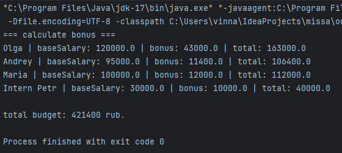
</details>

<br>

### <a id="title4">Задание 2.2: Sealed-интерфейс — система оплаты</a>

Спроектируйте систему обработки платежей с использованием sealed-интерфейса. Напишите весь код с нуля.

Требования:

1. sealed interface PaymentMethod permits CreditCard, BankTransfer, CryptoWallet с методами:

* String process(double amount) — возвращает строку-описание выполненной операции

* double fee(double amount) — возвращает комиссию

2. record CreditCard(String cardNumber, String holder):

* process() ? "Оплата картой *XXXX: Z руб." (последние 4 цифры номера)

* Комиссия = 2% от суммы

3. record BankTransfer(String bankName, String iban):

* process() ? "Перевод через БАНК: Z руб."

* Комиссия = фиксированные 50 руб.

4. record CryptoWallet(String address, String currency):

* process() ? "Криптоплатёж (ВАЛЮТА): Z руб."

* Комиссия = 1.5% от суммы

5. Класс PaymentProcessor со статическим методом describe(PaymentMethod pm), который использует switch с паттерн-матчингом (Java 21+) для вывода подробного описания.

```
public sealed interface PaymentMethod permits CreditCard, BankTransfer, CryptoWallet {
    
    String process(double amount);
    
    double fee(double amount);
}
```

```
public record CreditCard(String cardNumber, String holder) implements PaymentMethod {
    
    @Override
    public String process(double amount) {
        // Получаем последние 4 цифры номера карты
        String last4 = cardNumber.length() >= 4 
            ? cardNumber.substring(cardNumber.length() - 4) 
            : cardNumber;
        return String.format("Оплата картой *%s: %.0f руб.", last4, amount);
    }
    
    @Override
    public double fee(double amount) {
        return amount * 0.02; // 2% комиссия
    }
}
```

```
public record BankTransfer(String bankName, String iban) implements PaymentMethod {
    
    @Override
    public String process(double amount) {
        return String.format("Перевод через %s: %.0f руб.", bankName, amount);
    }
    
    @Override
    public double fee(double amount) {
        return 50.0; // фиксированная комиссия
    }
}
```

```
public record CryptoWallet(String address, String currency) implements PaymentMethod {
    
    @Override
    public String process(double amount) {
        return String.format("Криптоплатёж (%s): %.0f руб.", currency, amount);
    }
    
    @Override
    public double fee(double amount) {
        return amount * 0.015; // 1.5% комиссия
    }
}
```

```
public class PaymentProcessor {
    
    public static void describe(PaymentMethod pm) {
        // Используем switch с паттерн-матчингом (Java 21+)
        switch (pm) {
            case CreditCard cc -> System.out.printf(
                "  Описание: кредитная карта, владелец: %s, номер: ****%s%n",
                cc.holder(),
                cc.cardNumber().substring(cc.cardNumber().length() - 4)
            );
            
            case BankTransfer bt -> System.out.printf(
                "  Описание: банковский перевод, банк: %s, IBAN: %s%n",
                bt.bankName(),
                bt.iban()
            );
            
            case CryptoWallet cw -> System.out.printf(
                "  Описание: криптокошелёк, адрес: %s, валюта: %s%n",
                cw.address(),
                cw.currency()
            );
        }
    }
}
```

<details>
    <summary>result</summary>
    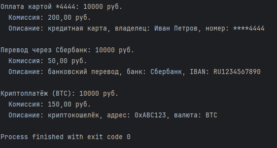
</details>

<br>

### <a id="title41">Задание 2.3: Интерфейсы — default, static и private методы</a>

Напишите интерфейс Loggable и два класса, реализующих его.

Требования к интерфейсу Loggable:

1. Абстрактный метод String getComponentName() — возвращает имя компонента

2. default метод void log(String message) — выводит сообщение в формате "[ВРЕМЯ] [ИМЯ_КОМПОНЕНТА] сообщение". Для форматирования времени используйте приватный метод formatTimestamp()

3. default метод void logError(String message) — аналогично, но с префиксом "ОШИБКА: " перед сообщением

4. private метод String formatTimestamp() — возвращает текущее время в формате "HH:mm:ss" (используйте java.time.LocalTime.now() и java.time.format.DateTimeFormatter)

5. static метод String getLogLevel() — возвращает "INFO"

Напишите два класса:

1. DatabaseService implements Loggable — с методом connect(String url), который логирует подключение

2. AuthService implements Loggable — с методом login(String username, boolean success), который логирует результат входа (при неудаче — через logError)

```
public class LoggableDemo {
    public static void main(String[] args) {
        DatabaseService db = new DatabaseService();
        AuthService auth = new AuthService();

        System.out.println("Уровень логирования: " + Loggable.getLogLevel());
        System.out.println();

        db.connect("jdbc:postgresql://localhost/mydb");
        System.out.println();

        auth.login("admin", true);
        auth.login("hacker", false);
    }
}
```

#### Решение

```
package practice_2.task_2_3;

public interface Loggable {
    abstract String getComponentName(); // возвращает имя компонента
    static String getLogLevel(){
        return "INFO";
    }
    default void log(String message){
        System.out.println(formatTimestamp() + " [" + getComponentName() + "] " + message);
    }
    default void logError(String message){
        System.out.println(formatTimestamp()+ " [" + getComponentName() + "] " + "Error: " + message);
    }
    private String formatTimestamp(){
        return java.time.format.DateTimeFormatter.ofPattern("'['HH:mm:ss']'").format(java.time.LocalTime.now());
    }
}

```

```
package practice_2.task_2_3;

public class AuthService implements Loggable{
    @Override
    public String getComponentName() {
        return getClass().getSimpleName();
    }
    void login(String username, boolean success){
        if (!success) {
            logError("entrance username: " + username + " - denied");
        } else{
            log("entrance username: " + username + " - permitted");
        }
    }
}

```

```
package practice_2.task_2_3;

public class DatabaseService implements Loggable{

    @Override
    public String getComponentName() {
        return getClass().getSimpleName();
    }

    void connect(String url){
        log("Connect: " + url);
        System.out.println("Connect set");
    }
}
```

```
package practice_2.task_2_3;

public class LoggableDemo {
    public static void main(String[] args) {
        DatabaseService db = new DatabaseService();
        AuthService auth = new AuthService();

        System.out.println("Level log: " + Loggable.getLogLevel());
        System.out.println();

        db.connect("jdbc:postgresql://localhost/mydb");
        System.out.println();

        auth.login("admin", true);
        auth.login("hacker", false);
    }
}
```

<details>
    <summary>result</summary>
    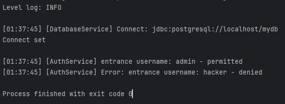
</details>

<br>

### <a id="title42">Задание 2.4: Абстрактный класс vs Интерфейс</a>

1. Все животные имеют имя и возраст, но звучат по-разному

* Абстрактный класс.

* Отношение "является", можно переопределить метод звучания: собака гавкает, кошка мяукает.

2. Некоторые объекты (документ, изображение, настройки) можно сериализовать:

* Интерфейс. 

* Отношение "умеет" с разными типами объектов, не связанных между собой. Настройки никак не связаны с фото или документов.  

3. Все транспортные средства имеют скорость и топливо, но двигаются по-разному:

* Абстрактный класс.

* Отношение "является", можно переопределить метод движения: машина едет, самолёт летит.

4. Робот, посудомоечная машина и телефон — все умеют подключаться к Wi-Fi

* Интерфейс.

* Отношение "умеет" с разными типами объектов, не связанных между собой. Посудомоечная машина никак не связаны с робото или телефоном.

5. Круг, квадрат и треугольник — все фигуры с площадью и периметром, у всех есть цвет.

* Абстрактный класс.

* Отношение "является" фигуры. Переопределять методы подсчёта площади и периметра.

6. Класс должен одновременно уметь летать, плавать и ездить.

* Интерфейс.

* Отношение "умеет" с разными типами объектов, не связанных между собой. Человек и утка.

<br>
<br>

---

### Часть 3: Массивы

### <a id="title5">Задание 3.1: Операции с матрицами</a>

Напишите класс MatrixOperations с нуля. Реализуйте статические методы для работы с двумерными массивами.

Требования:

1. static void print(int[][] matrix) — выводит матрицу в отформатированном виде (каждое число шириной 4 символа)

2. static int[][] transpose(int[][] matrix) — возвращает транспонированную матрицу (строки становятся столбцами)

3. static int[][] multiply(int[][] a, int[][] b) — умножение матриц. Если размеры несовместимы — выведите ошибку и верните null

4. static int diagonalSum(int[][] matrix) — сумма элементов главной диагонали

Напоминание: при умножении матриц C[i][j] = сумма(A[i][k] * B[k][j]) для всех k.

```
public class MatrixOperations {

    // Напишите все методы самостоятельно

    public static void main(String[] args) {
        int[][] a = {
            {1, 2, 3},
            {4, 5, 6}
        };

        int[][] b = {
            {7,  8},
            {9,  10},
            {11, 12}
        };

        System.out.println("Матрица A (2x3):");
        print(a);

        System.out.println("\nТранспонированная A (3x2):");
        print(transpose(a));

        System.out.println("\nМатрица B (3x2):");
        print(b);

        int[][] c = multiply(a, b);
        System.out.println("\nA * B (2x2):");
        print(c);

        System.out.println("\nСумма диагонали A*B: " + diagonalSum(c));
    }
}
```

Ожидаемый вывод:

```
Матрица A (2x3):
   1   2   3
   4   5   6

Транспонированная A (3x2):
   1   4
   2   5
   3   6

Матрица B (3x2):
   7   8
   9  10
  11  12

A * B (2x2):
  58  64
 139 154

Сумма диагонали A*B: 212
```

#### Решение

```
package practice_2.task_3_1;

public class MatrixOperations {

    // 1. Вывод матрицы с шириной 4 символа
    public static void print(int[][] matrix) {
        for (int i = 0; i < matrix.length; i++) {
            for (int j = 0; j < matrix[i].length; j++) {
                System.out.printf("%4d", matrix[i][j]);
            }
            System.out.println();
        }
    }

    // 2. Транспонирование матрицы
    public static int[][] transpose(int[][] matrix) {
        int rows = matrix.length;
        int cols = matrix[0].length;
        int[][] transposed = new int[cols][rows];

        for (int i = 0; i < rows; i++) {
            for (int j = 0; j < cols; j++) {
                transposed[j][i] = matrix[i][j];
            }
        }
        return transposed;
    }

    // 3. Умножение матриц
    public static int[][] multiply(int[][] a, int[][] b) {
        int aRows = a.length;
        int aCols = a[0].length;
        int bRows = b.length;
        int bCols = b[0].length;

        // Проверка совместимости
        if (aCols != bRows) {
            System.out.println("Ошибка: несовместимые размеры матриц для умножения");
            return null;
        }

        int[][] result = new int[aRows][bCols];

        for (int i = 0; i < aRows; i++) {
            for (int j = 0; j < bCols; j++) {
                int sum = 0;
                for (int k = 0; k < aCols; k++) {
                    sum += a[i][k] * b[k][j];
                }
                result[i][j] = sum;
            }
        }
        return result;
    }

    // 4. Сумма главной диагонали
    public static int diagonalSum(int[][] matrix) {
        int sum = 0;
        int minSize = Math.min(matrix.length, matrix[0].length);

        for (int i = 0; i < minSize; i++) {
            sum += matrix[i][i];
        }
        return sum;
    }

    // Тестовый main
    public static void main(String[] args) {
        int[][] a = {
                {1, 2, 3},
                {4, 5, 6}
        };

        int[][] b = {
                {7,  8},
                {9,  10},
                {11, 12}
        };

        System.out.println("Матрица A (2x3):");
        print(a);

        System.out.println("\nТранспонированная A (3x2):");
        print(transpose(a));

        System.out.println("\nМатрица B (3x2):");
        print(b);

        int[][] c = multiply(a, b);
        System.out.println("\nA * B (2x2):");
        print(c);

        System.out.println("\nСумма диагонали A*B: " + diagonalSum(c));
    }
}
```

<details>
    <summary>result</summary>
    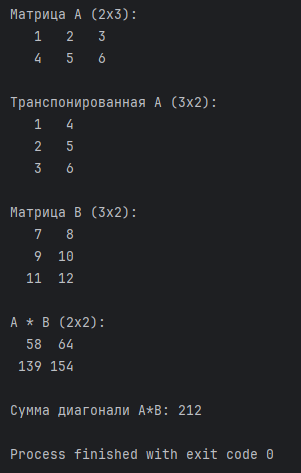
</details>

<br>

### <a id="title6">Задание 3.2: Зубчатый массив — журнал оценок</a>

Напишите программу GradeJournal.java, которая хранит оценки студентов в зубчатом массиве (у каждого студента разное количество оценок) и выполняет анализ.

Требования:

1. Создайте массив имён: {"Алиса", "Борис", "Вера", "Глеб"}

2. Создайте зубчатый массив int[][] с оценками:

   * Алиса: 5, 4, 5, 5, 3

   * Борис: 3, 3, 4

   * Вера: 5, 5, 5, 5, 5, 4

   * Глеб: 4, 3, 4, 5

3. Напишите метод double average(int[] grades) — средний балл

4. Напишите метод int max(int[] grades) — максимальная оценка

5. Напишите метод int min(int[] grades) — минимальная оценка

6. В main выведите для каждого студента: имя, количество оценок, средний балл, мин и макс

7. Найдите и выведите имя студента с наивысшим средним баллом

Ожидаемый вывод:

```
=== Журнал оценок ===
Алиса   | Оценок: 5 | Средний: 4.40 | Мин: 3 | Макс: 5
Борис   | Оценок: 3 | Средний: 3.33 | Мин: 3 | Макс: 4
Вера    | Оценок: 6 | Средний: 4.83 | Мин: 4 | Макс: 5
Глеб    | Оценок: 4 | Средний: 4.00 | Мин: 3 | Макс: 5

Лучший студент: Вера (средний балл: 4.83)

```

#### Решение

```
package practice_2.task_3_1;

public class GradeJournal {

    public static void main(String[] args) {
        // 1. Массив имён
        String[] names = {"Алиса", "Борис", "Вера", "Глеб"};

        // 2. Зубчатый массив с оценками
        int[][] grades = {
                {5, 4, 5, 5, 3},        // Алиса
                {3, 3, 4},              // Борис
                {5, 5, 5, 5, 5, 4},     // Вера
                {4, 3, 4, 5}            // Глеб
        };

        System.out.println("=== Журнал оценок ===");

        // Переменные для поиска лучшего студента
        double maxAverage = -1;
        String bestStudent = "";

        // 6. Вывод информации по каждому студенту
        for (int i = 0; i < names.length; i++) {
            int count = grades[i].length;
            double avg = average(grades[i]);
            int minGrade = min(grades[i]);
            int maxGrade = max(grades[i]);

            // Форматированный вывод
            System.out.printf("%-7s | Оценок: %d | Средний: %.2f | Мин: %d | Макс: %d%n",
                    names[i], count, avg, minGrade, maxGrade);

            // 7. Поиск лучшего студента
            if (avg > maxAverage) {
                maxAverage = avg;
                bestStudent = names[i];
            }
        }

        // Вывод лучшего студента
        System.out.printf("%nЛучший студент: %s (средний балл: %.2f)%n",
                bestStudent, maxAverage);
    }

    // 3. Средний балл
    public static double average(int[] grades) {
        if (grades.length == 0) return 0.0;

        int sum = 0;
        for (int grade : grades) {
            sum += grade;
        }
        return (double) sum / grades.length;
    }

    // 4. Максимальная оценка
    public static int max(int[] grades) {
        int max = grades[0];
        for (int grade : grades) {
            if (grade > max) {
                max = grade;
            }
        }
        return max;
    }

    // 5. Минимальная оценка
    public static int min(int[] grades) {
        int min = grades[0];
        for (int grade : grades) {
            if (grade < min) {
                min = grade;
            }
        }
        return min;
    }
}
```

<details>
    <summary>result</summary>
    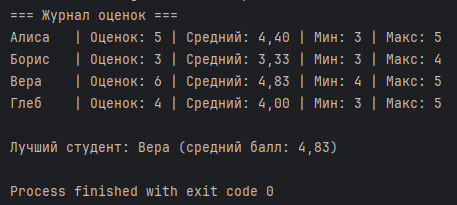
</details>

<br>
<br>

---

## Часть 4: Строки и StringBuilder

### <a id="title7">Задание 4.1: Анализатор текста</a>

Напишите класс TextAnalyzer с нуля. Класс принимает текст в конструкторе и предоставляет методы анализа.

Требования:

1. Конструктор TextAnalyzer(String text)

2. int wordCount() — количество слов (разделённых пробелами)

3. String longestWord() — самое длинное слово

4. String reverseWords() — текст с обратным порядком слов (не букв!). Например: "Привет мир Java" ? "Java мир Привет"

5. int countOccurrences(String target) — сколько раз подстрока встречается в тексте (без учёта регистра)

6. boolean isPalindrome() — является ли текст палиндромом (игнорируя регистр, пробелы и знаки препинания). Подсказка: оставьте только буквы через replaceAll("[^a-zA-Zа-яА-ЯёЁ]", "")

```
public class TextAnalyzer {

    // Напишите весь класс самостоятельно

    public static void main(String[] args) {
        TextAnalyzer ta = new TextAnalyzer("Java Programming is Fun and Java is Powerful");

        System.out.println("Текст: " + ta);
        System.out.println("Слов: " + ta.wordCount());
        System.out.println("Самое длинное слово: " + ta.longestWord());
        System.out.println("Слова наоборот: " + ta.reverseWords());
        System.out.println("'Java' встречается: " + ta.countOccurrences("java") + " раз(а)");
        System.out.println("'is' встречается: " + ta.countOccurrences("is") + " раз(а)");
        System.out.println("Палиндром: " + ta.isPalindrome());

        System.out.println();

        TextAnalyzer palindrome = new TextAnalyzer("А роза упала на лапу Азора");
        System.out.println("Текст: " + palindrome);
        System.out.println("Палиндром: " + palindrome.isPalindrome());
    }
}
```

#### Решение

```
package practice_2.task_4_1;

public class TextAnalyzer {

    private String text;

    TextAnalyzer(String text) {
        this.text = text;
    }
    int wordCount(){
        int count = 0;
        String[] arr = text.split(" ");
        return arr.length;
    }

    String longestWord(){
        int count = 0, max = 0;
        for (int i=0;i<text.length();i++){
            if (text.charAt(i) != ' '){
                count++;
            } else{
                max = Math.max(max, count);
                count = 0;
            }
        }
        max = Math.max(max, count);
        String res = "";
        String[] arr = text.split(" ");
        for (int i=0;i<arr.length;i++){
            if(arr[i].length() == max){
                res = arr[i];
                break;
            }
        }
        return res;
    }

    String reverseWords(){
        String res = "";
        int indexStart = text.length()-1, count = 0, counter = 0;
        for (int i =0;i<text.length();i++){
            if (text.charAt(i) == ' '){
                count++;
            }
        }
        for (int i = text.length()-1;i>=0;i--){
            if (text.charAt(i) == ' '){
                res = res + text.substring(i+1, indexStart+1) + " ";
                indexStart = i-1;
                ++counter;
            }
            if (count == counter && i == 0){
                res = res + text.substring(i, indexStart+1);
                break;
            }
        }
        return res;
    }

    int countOccurrences(String target){
        String res = text.toUpperCase();
        String targetRes = target.toUpperCase();
        int count=0, result = 0, j = 0;
        for (int i=0;i<res.length();i++){
            if (j<targetRes.length() && res.charAt(i) == targetRes.charAt(j)){
                count++;
                j++;

            } else{
                if (count == targetRes.length()){
                    result++;
                }
                count=0;
                j=0;
                if (res.charAt(i) == targetRes.charAt(0)){
                    count = 1;
                    j = 1;
                }
            }
        }
        if (count == targetRes.length()){
            result++;
        }
        return result;
    }

    boolean isPalindrome(){
        String res = text.replaceAll("[^a-zA-Zа-яА-ЯёЁ]", "").toUpperCase();
        String[] result = res.split("");
        String palindrome = "";
        for (int i=0;i<result.length;i++){
            palindrome = palindrome + result[i];
        }
        int count = 0;
        for (int i=0, j=palindrome.length()-1;i<=palindrome.length()-1 && j>=0;i++, j--){
            if (palindrome.charAt(i) == palindrome.charAt(j)){
                count++;
            }
        }
        if (count==palindrome.length()){
            return true;
        }
        return false;
    }
    // Напишите весь класс самостоятельно

    public static void main(String[] args) {
        TextAnalyzer ta = new TextAnalyzer("Java Programming is Fun and Java is Powerful");

        System.out.println("Текст: " + ta);
        System.out.println("Слов: " + ta.wordCount());
        System.out.println("Самое длинное слово: " + ta.longestWord());
        System.out.println("Слова наоборот: " + ta.reverseWords());
        System.out.println("'Java' встречается: " + ta.countOccurrences("java") + " раз(а)");
        System.out.println("'is' встречается: " + ta.countOccurrences("is") + " раз(а)");
        System.out.println("Палиндром: " + ta.isPalindrome());

        System.out.println();

        TextAnalyzer palindrome = new TextAnalyzer("А роза упала на лапу Азора");
        System.out.println("Текст: " + palindrome);
        System.out.println("Палиндром: " + palindrome.isPalindrome());
    }

    @Override
    public String toString() {
        return text;
    }
}
```

<details>
    <summary>result</summary>
    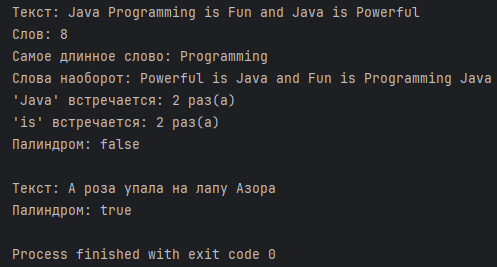
</details>

<br>

### <a id="title8">Задание 4.2: String Pool — исследование</a>

Напишите программу StringPoolLab.java, которая исследует поведение String Pool. Вы должны самостоятельно создать все примеры и предсказать результаты до запуска.

Требования:

1. Создайте строки 6 разными способами:

* s1 — строковый литерал "Hello"

* s2 — ещё один литерал "Hello"

* s3 — через new String("Hello")

* s4 — через new String("Hello")

* s5 — через s3.intern()

* s6 — результат конкатенации: "Hel" + "lo" (литералы)

* s7 — результат конкатенации с переменной: String half = "Hel"; String s7 = half + "lo";

2. Для каждой пары выведите результат == и .equals():

* s1 и s2

* s1 и s3

* s3 и s4

* s1 и s5

* s1 и s6

* s1 и s7

3. Перед каждым сравнением напишите в комментарии ваш прогноз и объяснение.

4. В конце программы используя StringBuilder соберите строку "Hello" по буквам и сравните её с s1 через == и .equals().

#### Решение

```
package practice_2.task_4_2;

public class StringPoolLab {
    public static void main(String[] args){
        String s1 = "Hello";
        /*
        Переменная s1 будет содержать ссылку на объект в памяти = в куче в String Pool, где будет храниться объект.
         */
            String s2 = "Hello";
        /*
        Переменная s2 будет содержать ссылку на уже созданный объект в памяти = в куче в String Pool, где будет храниться объект.
         */
            String s3 = new String("Hello");
        /*
        Переменная s3 создаст новый объект и не поместит его в String Pool, поместит в кучу.
         */
            String s4 = new String("Hello");
        /*
        Переменная s4 создаст новый объект и не поместит его в String Pool, поместит в кучу. s4 и s3 2 разных объекта в памяти. s1 и s2 указывают на одини тот же объект в памяти.
         */
            String s5 = s3.intern();
        /*
        Переменная s5 будет искать содержимое объекта s3, найдя вернёт ссылку для объекта, который лежит в String Pool (вместо создания нового объекта).
         */
            String s6 = "Hel" + "lo";
        /*
        Переменная s6 сделает конкатенацию 2 строк и положит в String Pool.
         */
        String half = "Hel";
        String s7 = half + "lo";
        /*
        Переменная s7 сделает конкатенацию строк и положит в кучу не в String Pool
         */
        System.out.println(s1 == s2); // сравнивает адреса в памяти, return true
        System.out.println(s1.equals(s2)); // сравнивает содержимое, return true
        System.out.println(s1 == s3); // сравнивает адреса в памяти, return false
        System.out.println(s1.equals(s3)); // сравнивает содержимое, return true
        System.out.println(s3 == s4); // сравнивает адреса в памяти, return false
        System.out.println(s3.equals(s4)); // сравнивает содержимое, return true
        System.out.println(s1 == s5); // сравнивает адреса в памяти, return true
        System.out.println(s1.equals(s5)); // сравнивает содержимое, return true
        System.out.println(s1 == s7); // сравнивает адреса в памяти, return false
        System.out.println(s1.equals(s7)); // сравнивает содержимое, return true
        StringBuilder stringBuilder = new StringBuilder();
        stringBuilder.append("H");
        System.out.println(stringBuilder);
        stringBuilder.append("e");
        System.out.println(stringBuilder);
        stringBuilder.append("l");
        System.out.println(stringBuilder);
        stringBuilder.append("l");
        System.out.println(stringBuilder);
        stringBuilder.append("o");
        System.out.println(stringBuilder);
        //System.out.println(s1 == stringBuilder); // нельзя сравнивать
        System.out.println(s1.equals(stringBuilder)); // false
        String s8 = stringBuilder.toString();
        System.out.println(s8 == s1); // сравнивает адреса в памяти, return false
        System.out.println(s8.equals(s1)); // сравнивает содержимое, return true
    }
}
```

<details>
    <summary>result</summary>
    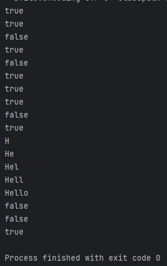
</details>

<br>
<br>

---

## Задание 5.1: Система оценок

### <a id="title9">Задание 5.1: Система оценок</a>

Задание 5.1: Система оценок
Напишите систему оценок студентов с нуля. Используйте record, enum, EnumMap и EnumSet.

Требования:

1. enum Grade с константами A, B, C, D, F:

* Поле String description (Отлично, Хорошо, Удовлетворительно, Неудовлетворительно, Провал)

* Поле double gpaValue (4.0, 3.0, 2.0, 1.0, 0.0)

* Конструктор, геттеры

* Метод boolean isPassing() — true если не F и не D

* Метод static Grade fromScore(int score) — преобразует числовую оценку (0–100) в Grade: A ? 90, B ? 80, C ? 70, D ? 60, иначе F

2. record Student(String name, int id) с компактным конструктором, который:

* Проверяет, что name не null и не пустое

* Проверяет, что id > 0

* Выбрасывает IllegalArgumentException при нарушении

3. В main:

* Создайте 6–7 студентов и присвойте им числовые оценки (используйте Grade.fromScore())

* Используйте EnumMap<Grade, List<Student>> для группировки студентов по оценкам

* Используйте EnumSet для получения множества "проходных" оценок

* Выведите сводку: для каждой оценки — список студентов и их количество

* Подсчитайте средний GPA всех студентов

```
import java.util.*;

public class GradeSystem {

    // Напишите enum Grade, record Student и main самостоятельно

    public static void main(String[] args) {
        // Создайте студентов и оценки
        // Сгруппируйте через EnumMap
        // Выведите сводку
    }
}
```

#### Решение

```
package practice_2.task_5_1;

public record Student(String name, int id) {
    public Student{
        if (name == null || name.isEmpty() ){
            throw new IllegalArgumentException("Нарушено правило валидации строк");
        }
        if (id <= 0){
            throw new IllegalArgumentException("Нарушено правило валидации идентификаторов");
        }
    }
}
```

```
package practice_2.task_5_1;

public enum Grade {
    A("Excellent", 5.0),
    B("Good", 3.0),
    C("Normal", 2.0),
    D("Poor", 1.0),
    F("Fail", 0.0);

    String description;

    double gpaValue;

    Grade(String description, double gpaValue) {
        this.description=description;
        this.gpaValue=gpaValue;
    }

    public String getDescription() {
        return description;
    }

    public double getGpaValue() {
        return gpaValue;
    }

    static Grade fromScore(int score){
        if (score >= 90) return A;
        else if (score >= 80) return B;
        else if (score >= 70) return C;
        else if (score >= 60) return D;
        else return F;
    }
    boolean isPassing(){
        return (this != F && this != D);
    }
}
```

```
package practice_2.task_5_1;

import java.util.ArrayList;
import java.util.EnumMap;
import java.util.EnumSet;
import java.util.List;

public class GradeSystem {
    public static void main(String[] args) {
        Student student1 = new Student("Alex", 1);
        Student student2 = new Student("Bon", 2);
        Student student3 = new Student("Caroline", 3);
        Student student4 = new Student("Dean", 4);
        Student student5 = new Student("Egg", 5);
        Student student6 = new Student("Fionna", 6);
        Student student7 = new Student("German", 7);

        Grade grade1 = Grade.fromScore(97);
        Grade grade2 = Grade.fromScore(72);
        Grade grade3 = Grade.fromScore(56);
        Grade grade4 = Grade.fromScore(57);
        Grade grade5 = Grade.fromScore(87);
        Grade grade6 = Grade.fromScore(65);
        Grade grade7 = Grade.fromScore(67);

        EnumMap<Grade, List<Student>> map = new EnumMap<>(Grade.class);

        for (Grade g : Grade.values()){
            map.put(g, new ArrayList<>());
        }

        map.get(grade1).add(student1); // список студентов получивших соответствующую оценку
        map.get(grade2).add(student2);
        map.get(grade3).add(student3);
        map.get(grade4).add(student4);
        map.get(grade5).add(student5);
        map.get(grade6).add(student6);
        map.get(grade7).add(student7);

        EnumSet<Grade> passingGrades = EnumSet.noneOf(Grade.class); // пустой множество для указанного типа перечисления
        for (Grade g : Grade.values()){
            if (g.isPassing()){
                passingGrades.add(g);
            }
        }

        double totalGpa = 0.0;
        int totalStudents = 0;

        for (Grade grade : Grade.values()) {
            List<Student> studentsInGrade = map.get(grade);
            int count = studentsInGrade.size();

            System.out.println(grade + " (" + grade.getDescription() + "): " + count + " student/students");

            if (count > 0) {
                System.out.print("  Students: ");
                for (Student s : studentsInGrade) {
                    System.out.print(s.name() + " ");
                }
                System.out.println();
            }

            totalGpa += grade.getGpaValue() * count;
            totalStudents += count;
        }

        System.out.println("PassingGrades: " + passingGrades);
        System.out.print("Students : ");
        for (Grade g : passingGrades) {
            for (Student s : map.get(g)) {
                System.out.print(s.name() + " ");
            }
        }
        System.out.println();
        double averageGpa = totalStudents > 0 ? totalGpa / totalStudents : 0.0;
        System.out.printf("%nAvg GPA all students: %.2f%n", averageGpa);
    }
}
```

<details>
    <summary>result</summary>
    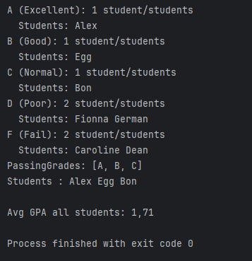
</details>

<br>

### <a id="title10">Задание 5.2: Record с бизнес-логикой и Enum с абстрактным методом</a>

Часть A: Напишите record Temperature(double value, Unit unit):

* enum Unit { CELSIUS, FAHRENHEIT, KELVIN }

* Компактный конструктор: проверьте, что значение в Кельвинах не ниже 0 (абсолютный ноль). Для этого во всех единицах переведите в Кельвины и проверьте.

* Метод Temperature convertTo(Unit targetUnit) — конвертирует температуру

* Переопределённый toString() — формат: "36.6 °C" или "97.88 °F" или "309.75 K"

Часть B: Напишите enum MathOperation:

* Константы: ADD, SUBTRACT, MULTIPLY, DIVIDE

* У каждой константы — абстрактный метод double apply(double a, double b), реализованный индивидуально

* У DIVIDE — проверка деления на ноль (выбросить ArithmeticException)

```
public class RecordEnumDemo {
    public static void main(String[] args) {
        Temperature body = new Temperature(36.6, Temperature.Unit.CELSIUS);
        System.out.println(body);
        System.out.println(body.convertTo(Temperature.Unit.FAHRENHEIT));
        System.out.println(body.convertTo(Temperature.Unit.KELVIN));

        System.out.println();

        double a = 10, b = 3;
        for (MathOperation op : MathOperation.values()) {
            System.out.printf("%s(%g, %g) = %g%n", op.name(), a, b, op.apply(a, b));
        }
    }
}
```

#### Решение

```
package practice_2.task_5_2;

public record Temperature(double value, Unit unit) {

    public enum Unit {
        CELSIUS, FAHRENHEIT, KELVIN
    }

    // Компактный конструктор с проверкой абсолютного нуля
    public Temperature {
        // Переводим в Кельвины для проверки
        double kelvinValue = switch (unit) {
            case CELSIUS -> value + 273.15;
            case FAHRENHEIT -> (value - 32) * 5.0 / 9.0 + 273.15;
            case KELVIN -> value;
        };

        if (kelvinValue < 0) {
            throw new IllegalArgumentException(
                    "Температура не может быть ниже абсолютного нуля (0K)"
            );
        }
    }

    // Метод конвертации в другую единицу измерения
    public Temperature convertTo(Unit targetUnit) {
        if (this.unit == targetUnit) {
            return this;
        }

        // Сначала переводим в Кельвины
        double kelvin = switch (this.unit) {
            case CELSIUS -> this.value + 273.15;
            case FAHRENHEIT -> (this.value - 32) * 5.0 / 9.0 + 273.15;
            case KELVIN -> this.value;
        };

        // Затем из Кельвинов в целевую единицу
        double convertedValue = switch (targetUnit) {
            case CELSIUS -> kelvin - 273.15;
            case FAHRENHEIT -> (kelvin - 273.15) * 9.0 / 5.0 + 32;
            case KELVIN -> kelvin;
        };

        return new Temperature(convertedValue, targetUnit);
    }

    // Переопределённый toString()
    @Override
    public String toString() {
        String symbol = switch (unit) {
            case CELSIUS -> "°C";
            case FAHRENHEIT -> "°F";
            case KELVIN -> "K";
        };
        return String.format("%.2f %s", value, symbol);
    }
}
```

```
package practice_2.task_5_2;

public enum MathOperation {
    ADD {
        @Override
        public double apply(double a, double b) {
            return a + b;
        }
    },
    SUBTRACT {
        @Override
        public double apply(double a, double b) {
            return a - b;
        }
    },
    MULTIPLY {
        @Override
        public double apply(double a, double b) {
            return a * b;
        }
    },
    DIVIDE {
        @Override
        public double apply(double a, double b) {
            if (b == 0) {
                throw new ArithmeticException("Деление на ноль невозможно");
            }
            return a / b;
        }
    };

    // Абстрактный метод, реализуемый каждой константой
    public abstract double apply(double a, double b);
}
```

```
package practice_2.task_5_2;

public class RecordEnumDemo {
    public static void main(String[] args) {
        Temperature body = new Temperature(36.6, Temperature.Unit.CELSIUS);
        System.out.println(body);
        System.out.println(body.convertTo(Temperature.Unit.FAHRENHEIT));
        System.out.println(body.convertTo(Temperature.Unit.KELVIN));

        System.out.println();

        double a = 10, b = 3;
        for (MathOperation op : MathOperation.values()) {
            System.out.printf("%s(%g, %g) = %g%n", op.name(), a, b, op.apply(a, b));
        }
    }
}

```

<details>
    <summary>result</summary>
    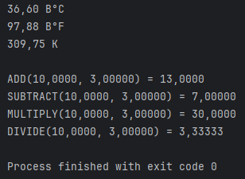
</details>

<br>
<br>

---

## Часть 6: Аннотации

### <a id="title11">Задание 6.1: Собственная аннотация + обработка через Reflection</a>

Это задание состоит из двух частей. В первой части заполните пропуски (синтаксис аннотаций). Во второй части напишите дополнительную аннотацию с нуля.

Часть A: Заполните пропуски

Дополните объявление аннотации @TestInfo:

```
import java.lang.annotation.*;
import java.lang.reflect.Method;

@Retention(____)      // доступна во время выполнения через Reflection
@Target(____)         // применяется к методам
@interface TestInfo {
    ____;             // String author()
    ____;             // String date()
    ____;             // String description() default ""
    ____;             // int priority() default 5
}
```

Часть B: Напишите полностью с нуля

Создайте файл ValidationFramework.java — мини-фреймворк валидации с аннотациями и Reflection.

Требования:

1. Аннотация @NotEmpty — применяется к полям типа String, RetentionPolicy = RUNTIME. Параметр: String message() default "Поле не может быть пустым"

2. Аннотация @Range — применяется к полям типа int, RetentionPolicy = RUNTIME. Параметры: int min(), int max(), String message() default "Значение вне допустимого диапазона"

3. Класс RegistrationForm с полями:

* @NotEmpty(message = "Имя обязательно") String name

* @NotEmpty String email

* @Range(min = 18, max = 120, message = "Возраст должен быть от 18 до 120") int age

4. Класс Validator со статическим методом List<String> validate(Object obj), который через Reflection:

* Проходит по всем полям объекта

* Для @NotEmpty — проверяет, что строка не null и не пустая

* Для @Range — проверяет, что число в указанном диапазоне

* Возвращает список сообщений об ошибках (пустой список = валидация пройдена)

```
public class ValidationFramework {
    public static void main(String[] args) {
        RegistrationForm valid = new RegistrationForm("Иван", "ivan@mail.ru", 25);
        RegistrationForm invalid = new RegistrationForm("", null, 15);

        System.out.println("=== Валидация корректной формы ===");
        List<String> errors1 = Validator.validate(valid);
        System.out.println(errors1.isEmpty() ? "Все поля валидны!" : errors1);

        System.out.println("\n=== Валидация некорректной формы ===");
        List<String> errors2 = Validator.validate(invalid);
        errors2.forEach(e -> System.out.println("  - " + e));
    }
}
```

Ожидаемый вывод:

```
=== Валидация корректной формы ===
Все поля валидны!

=== Валидация некорректной формы ===
  - Имя обязательно
  - Поле не может быть пустым
  - Возраст должен быть от 18 до 120

```

#### Решение

```
package practice_2.task_6_1;

public class RegistrationForm {
    @NotEmpty(message = "Name must")
    String name;

    @NotEmpty
    String email;

    @Range(min = 18, max = 120, message = "Year: 18 - 120")
    int age;

    public RegistrationForm(String name, String email, int age) {
        this.name = name;
        this.email = email;
        this.age = age;
    }
}
```

```
package practice_2.task_6_1;

import java.lang.reflect.Field;
import java.util.ArrayList;
import java.util.List;

class Validator {
    public static List<String> validate(Object obj) {
        List<String> errors = new ArrayList<>();

        Class<?> clazz = obj.getClass();
        Field[] fields = clazz.getDeclaredFields();

        for (Field field : fields) {
            field.setAccessible(true);

            try {
                // Проверка @NotEmpty
                if (field.isAnnotationPresent(NotEmpty.class)) {
                    NotEmpty annotation = field.getAnnotation(NotEmpty.class);
                    String value = (String) field.get(obj);

                    if (value == null || value.trim().isEmpty()) {
                        errors.add(annotation.message());
                    }
                }

                // Проверка @Range
                if (field.isAnnotationPresent(Range.class)) {
                    Range annotation = field.getAnnotation(Range.class);
                    int value = field.getInt(obj);

                    if (value < annotation.min() || value > annotation.max()) {
                        errors.add(annotation.message());
                    }
                }

            } catch (IllegalAccessException e) {
                errors.add("Ошибка доступа к полю: " + field.getName());
            }
        }

        return errors;
    }
}
```

```
package practice_2.task_6_1;

import java.lang.annotation.ElementType;
import java.lang.annotation.Retention;
import java.lang.annotation.RetentionPolicy;
import java.lang.annotation.Target;
import java.util.List;

// Аннотация @NotEmpty
@Retention(RetentionPolicy.RUNTIME)
@Target(ElementType.FIELD)
@interface NotEmpty {
    String message() default "Поле не может быть пустым";
}

// Аннотация @Range
@Retention(RetentionPolicy.RUNTIME)
@Target(ElementType.FIELD)
@interface Range {
    int min();
    int max();
    String message() default "Значение вне допустимого диапазона";
}

public class ValidationFramework {
    public static void main(String[] args) {
        RegistrationForm valid = new RegistrationForm("Иван", "ivan@mail.ru", 25);
        RegistrationForm invalid = new RegistrationForm("", null, 15);

        System.out.println("=== Валидация корректной формы ===");
        List<String> errors1 = Validator.validate(valid);
        System.out.println(errors1.isEmpty() ? "Все поля валидны!" : errors1);

        System.out.println("\n=== Валидация некорректной формы ===");
        List<String> errors2 = Validator.validate(invalid);
        errors2.forEach(e -> System.out.println("  - " + e));
    }
}
```

<details>
    <summary>result</summary>
    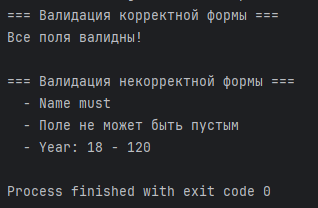
</details>

<br>
<br>

---

## Часть 7: Анонимные классы, локальные классы, лямбды и ссылки на методы

### <a id="title12">Задание 7.1: Эволюция кода — от анонимного класса к ссылке на метод</a>

Вам дан код, использующий анонимные классы. Выполните три этапа рефакторинга.

Этап 1: Перепишите этот код — замените каждый анонимный класс на лямбда-выражение. Сохраните в файле RefactorStep1.java.

Этап 2: Там, где это возможно, замените лямбды на ссылки на методы. Сохраните в файле RefactorStep2.java.

Этап 3: В комментариях объясните, какие лямбды нельзя заменить на ссылки на методы и почему.

```
import java.util.*;
import java.util.function.*;

public class RefactorOriginal {
    public static void main(String[] args) {
        List<String> cities = Arrays.asList("Москва", "Берлин", "Токио", "Нью-Йорк", "Париж");

        // 1. Сортировка по длине
        cities.sort(new Comparator<String>() {
            @Override
            public int compare(String a, String b) {
                return Integer.compare(a.length(), b.length());
            }
        });

        // 2. Вывод каждого элемента
        cities.forEach(new Consumer<String>() {
            @Override
            public void accept(String city) {
                System.out.println(city);
            }
        });

        // 3. Преобразование в верхний регистр
        Function<String, String> toUpper = new Function<String, String>() {
            @Override
            public String apply(String s) {
                return s.toUpperCase();
            }
        };

        // 4. Проверка длины > 5
        Predicate<String> isLong = new Predicate<String>() {
            @Override
            public boolean test(String s) {
                return s.length() > 5;
            }
        };

        // 5. Формирование строки с восклицательным знаком
        Function<String, String> exclaim = new Function<String, String>() {
            @Override
            public String apply(String s) {
                return s + "!";
            }
        };

        // 6. Создание нового списка
        Supplier<List<String>> listFactory = new Supplier<List<String>>() {
            @Override
            public List<String> get() {
                return new ArrayList<>();
            }
        };

        // Использование
        List<String> result = listFactory.get();
        for (String city : cities) {
            if (isLong.test(city)) {
                result.add(toUpper.apply(city));
            }
        }
        System.out.println("Длинные города: " + result);
    }
}
```

#### Решение

Этап 1: лямбда

```
package practice_2.task_7_1;

import java.util.ArrayList;
import java.util.Arrays;
import java.util.List;
import java.util.function.Function;
import java.util.function.Predicate;
import java.util.function.Supplier;

public class RefactorStep1 {
    public static void main(String[] args) {
        List<String> cities = Arrays.asList("Москва", "Берлин", "Токио", "Нью-Йорк", "Париж");

        // 1. Сортировка по длине (лямбда)
        cities.sort((a, b) -> Integer.compare(a.length(), b.length()));

        // 2. Вывод каждого элемента (лямбда)
        cities.forEach(city -> System.out.println(city));

        // 3. Преобразование в верхний регистр (лямбда)
        Function<String, String> toUpper = s -> s.toUpperCase();

        // 4. Проверка длины > 5 (лямбда)
        Predicate<String> isLong = s -> s.length() > 5;

        // 5. Формирование строки с восклицательным знаком (лямбда)
        Function<String, String> exclaim = s -> s + "!";

        // 6. Создание нового списка (лямбда)
        Supplier<List<String>> listFactory = () -> new ArrayList<>();

        // Использование
        List<String> result = listFactory.get();
        for (String city : cities) {
            if (isLong.test(city)) {
                result.add(toUpper.apply(city));
            }
        }
        System.out.println("Длинные города: " + result);

        // Демонстрация exclaim
        System.out.println("С восклицательным знаком: ");
        cities.stream().map(exclaim).forEach(s -> System.out.print(s + " "));
    }
}
```

```
package practice_2.task_7_1;

import java.util.*;
import java.util.function.*;

public class RefactorStep2 {
    public static void main(String[] args) {
        List<String> cities = Arrays.asList("Москва", "Берлин", "Токио", "Нью-Йорк", "Париж");

        // 1. Сортировка по длине
        // Нельзя заменить на ссылку на метод, т.к. используется внешний Comparator.comparingInt
        cities.sort(Comparator.comparingInt(String::length));

        // 2. Вывод каждого элемента (ссылка на метод)
        cities.forEach(System.out::println);

        // 3. Преобразование в верхний регистр (ссылка на метод)
        Function<String, String> toUpper = String::toUpperCase;

        // 4. Проверка длины > 5
        // Нельзя заменить на ссылку на метод, т.к. есть дополнительное условие (> 5)
        Predicate<String> isLong = s -> s.length() > 5;

        // 5. Формирование строки с восклицательным знаком
        // Нельзя заменить на ссылку на метод, т.к. выполняется конкатенация строк
        Function<String, String> exclaim = s -> s + "!";

        // 6. Создание нового списка (ссылка на конструктор)
        Supplier<List<String>> listFactory = ArrayList::new;

        // Использование
        List<String> result = listFactory.get();
        for (String city : cities) {
            if (isLong.test(city)) {
                result.add(toUpper.apply(city));
            }
        }
        System.out.println("Длинные города: " + result);

        // Демонстрация exclaim
        System.out.println("С восклицательным знаком: ");
        cities.stream().map(exclaim).forEach(s -> System.out.print(s + " "));
    }
}
```

<details>
   <summary>7.1.3</summary>
   
   1. Сортировка по длине
    
   Исходная лямбда: (a, b) -> Integer.compare(a.length(), b.length())
   
   * Можно ли заменить на ссылку на метод? Нет
   
   * Почему? Прямую ссылку на метод использовать нельзя, потому что требуется Comparator, который принимает два аргумента и сравнивает их. Ссылка на метод может заменить только прямой вызов метода с той же сигнатурой. Однако можно использовать фабричный метод Comparator.comparingInt(String::length), который внутри создаёт компаратор, но это не прямая замена лямбды на ссылку на метод.
   
   2. Вывод каждого элемента
      
   Исходная лямбда: city -> System.out.println(city)
   
   * Можно ли заменить на ссылку на метод? Да
   
   * Почему? Сигнатура лямбды полностью совпадает с сигнатурой метода println:
   
     * Лямбда принимает String и возвращает void
   
     * Метод System.out.println(String) принимает String и возвращает void
   
     * Замена: System.out::println
   
   3. Преобразование в верхний регистр
      Исходная лямбда: s -> s.toUpperCase()
   
   * Можно ли заменить на ссылку на метод? Да
   
   * Почему? Сигнатуры полностью совпадают:
   
     * Лямбда принимает String и возвращает String
   
     * Метод toUpperCase() не принимает аргументов и возвращает String
   
     * Замена: String::toUpperCase
   
   4. Проверка длины больше 5
      Исходная лямбда: s -> s.length() > 5
   
   * Можно ли заменить на ссылку на метод? Нет
   
   * Почему? Ссылка на метод может заменить только прямой вызов метода без дополнительных операций. Здесь выполняется:
   
     * Вызов метода length()
   
     * Операция сравнения > 5
   
     * Наличие логической операции (сравнения) делает невозможным использование ссылки на метод. Пришлось бы создавать отдельный метод isLongerThan5(String s), что только усложнит код.
   
   5. Формирование строки с восклицательным знаком
      Исходная лямбда: s -> s + "!"
   
   * Можно ли заменить на ссылку на метод? Нет
   
   * Почему? Оператор + для строк — это не вызов метода, а операция конкатенации. Ссылка на метод требует существующего метода с подходящей сигнатурой. В классе String нет метода, который добавляет восклицательный знак. Можно было бы создать статический метод-утилиту, но это выходит за рамки простой замены лямбды.
   
   6. Создание нового списка
   Исходная лямбда: () -> new ArrayList<>()
   
   * Можно ли заменить на ссылку на метод? Да
   
   * Почему? Это вызов конструктора без параметров:
   
     * Лямбда не принимает аргументов и возвращает ArrayList<String>
   
     * Конструктор ArrayList() не принимает аргументов и создаёт объект ArrayList
   
     * Замена: ArrayList::new (ссылка на конструктор)
</details>

<details>
    <summary>result</summary>
    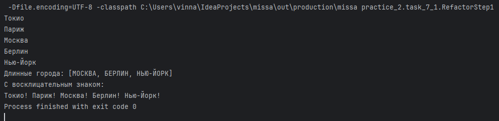
    <br>
    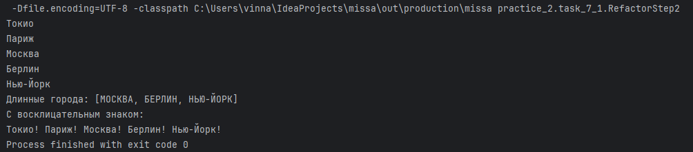
</details>

<br>

### <a id="title13">Задание 7.2: Конвейер обработки данных (Stream API)</a>

Напишите программу OrderAnalytics.java с нуля. Используйте Stream API, лямбды и ссылки на методы для обработки данных.

Дано:

```
record Order(String customer, String product, double price, int quantity, String category) {
    double total() { return price * quantity; }
}
```

Создайте список заказов (10+) и выполните следующие операции через Stream API:

1. Найдите все заказы дороже 5000 руб. (по total()) и выведите их

2. Получите список уникальных имён клиентов (List<String>), отсортированный по алфавиту

3. Вычислите общую выручку (сумма всех total())

4. Найдите самый дорогой заказ (по total())

5. Подсчитайте количество заказов в каждой категории (Map<String, Long>)

6. Вычислите среднюю стоимость заказа по каждому клиенту (Map<String, Double>)

7. Разделите заказы на две группы: дорогие (total > 3000) и дешёвые (Map<Boolean, List<Order>>)

8. Получите список названий товаров дороже 1000 руб., без дубликатов, в верхнем регистре

Используйте ссылки на методы вместо лямбд везде, где это возможно (например, Order::total, System.out::println).

#### Решение

```
package practice_2.task_7_2;

import java.util.*;
import java.util.stream.*;

public class OrderAnalytics {

    // Record Order с методом total()
    record Order(String customer, String product, double price, int quantity, String category) {
        double total() {
            return price * quantity;
        }
    }

    public static void main(String[] args) {
        // Создание списка заказов (10+)
        List<Order> orders = Arrays.asList(
                new Order("Иван Петров", "Ноутбук", 45000, 1, "Электроника"),
                new Order("Мария Иванова", "Смартфон", 25000, 2, "Электроника"),
                new Order("Иван Петров", "Мышь", 1500, 3, "Компьютерные аксессуары"),
                new Order("Алексей Смирнов", "Клавиатура", 3500, 1, "Компьютерные аксессуары"),
                new Order("Елена Козлова", "Кофеварка", 12000, 1, "Бытовая техника"),
                new Order("Дмитрий Новиков", "Чайник", 3000, 2, "Бытовая техника"),
                new Order("Анна Морозова", "Пылесос", 15000, 1, "Бытовая техника"),
                new Order("Иван Петров", "Монитор", 18000, 1, "Компьютерные аксессуары"),
                new Order("Мария Иванова", "Наушники", 5000, 1, "Аудиотехника"),
                new Order("Сергей Волков", "Планшет", 30000, 1, "Электроника"),
                new Order("Ольга Соколова", "Фен", 2500, 2, "Бытовая техника"),
                new Order("Игорь Козлов", "Внешний диск", 6000, 1, "Компьютерные аксессуары")
        );

        // 1. Заказы дороже 5000 руб.
        System.out.println("1. Заказы дороже 5000 руб.:");
        orders.stream()
                .filter(order -> order.total() > 5000)
                .forEach(System.out::println);

        // 2. Уникальные имена клиентов, отсортированные по алфавиту
        System.out.println("\n2. Уникальные клиенты (по алфавиту):");
        List<String> uniqueCustomers = orders.stream()
                .map(Order::customer)
                .distinct()
                .sorted()
                .collect(Collectors.toList());
        uniqueCustomers.forEach(System.out::println);

        // 3. Общая выручка
        System.out.println("\n3. Общая выручка:");
        double totalRevenue = orders.stream()
                .mapToDouble(Order::total)
                .sum();
        System.out.printf("Общая выручка: %.2f руб.%n", totalRevenue);

        // 4. Самый дорогой заказ
        System.out.println("\n4. Самый дорогой заказ:");
        orders.stream()
                .max(Comparator.comparingDouble(Order::total))
                .ifPresent(System.out::println);

        // 5. Количество заказов в каждой категории
        System.out.println("\n5. Количество заказов по категориям:");
        Map<String, Long> ordersByCategory = orders.stream()
                .collect(Collectors.groupingBy(
                        Order::category,
                        Collectors.counting()
                ));
        ordersByCategory.forEach((category, count) ->
                System.out.printf("  %s: %d заказ(ов)%n", category, count));

        // 6. Средняя стоимость заказа по каждому клиенту
        System.out.println("\n6. Средняя стоимость заказа по клиентам:");
        Map<String, Double> avgOrderByCustomer = orders.stream()
                .collect(Collectors.groupingBy(
                        Order::customer,
                        Collectors.averagingDouble(Order::total)
                ));
        avgOrderByCustomer.forEach((customer, avg) ->
                System.out.printf("  %s: %.2f руб.%n", customer, avg));

        // 7. Разделение на дорогие и дешёвые заказы
        System.out.println("\n7. Разделение заказов (дорогие > 3000 руб.):");
        Map<Boolean, List<Order>> partitionedOrders = orders.stream()
                .collect(Collectors.partitioningBy(
                        order -> order.total() > 3000
                ));

        System.out.println("Дорогие заказы (> 3000 руб.):");
        partitionedOrders.get(true)
                .forEach(order -> System.out.println("  " + order));

        System.out.println("\nДешёвые заказы (<= 3000 руб.):");
        partitionedOrders.get(false)
                .forEach(order -> System.out.println("  " + order));

        // 8. Список товаров дороже 1000 руб., без дубликатов, в верхнем регистре
        System.out.println("\n8. Уникальные товары дороже 1000 руб. (в верхнем регистре):");
        List<String> expensiveProducts = orders.stream()
                .filter(order -> order.price() > 1000)
                .map(Order::product)
                .distinct()
                .map(String::toUpperCase)
                .collect(Collectors.toList());
        expensiveProducts.forEach(System.out::println);
    }
}
```

<details>
    <summary>result</summary>
    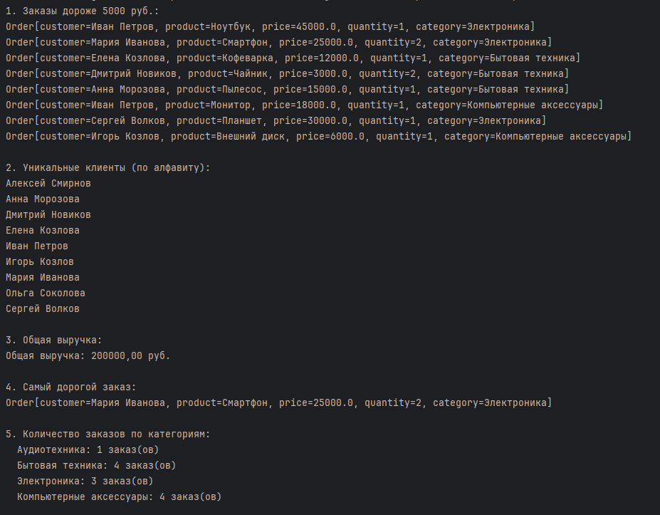
    <br>
    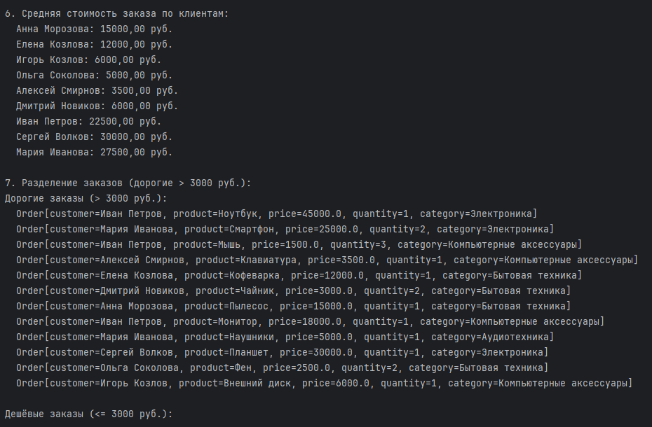
    <br>
    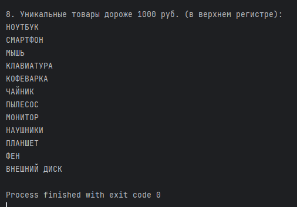
</details>

<br>

### <a id="title14">Задание 7.3: Композиция функций и локальный класс</a>

Напишите программу TextPipeline.java.

Часть A — Композиция функций:

Создайте набор Function<String, String> и скомпонуйте их в конвейер:

1. trim — удаляет пробелы по краям

2. lower — переводит в нижний регистр

3. removeExtraSpaces — заменяет множественные пробелы на один (через replaceAll("\\s+", " "))

4. capitalize — делает первую букву заглавной

Скомпонуйте их через andThen() в одну функцию normalize и примените к нескольким строкам.

Часть B — Локальный класс:

Внутри метода main объявите локальный класс WordCounter, который:

* Принимает строку в конструкторе

* Имеет метод Map<String, Integer> count() — возвращает частотный словарь слов (сколько раз каждое слово встречается)

* Имеет метод String mostFrequent() — возвращает самое частое слово

Используйте WordCounter для анализа нормализованного текста.

#### Решение

```
package practice_2.task_7_3;

import java.util.*;
import java.util.function.Function;

public class TextPipeline {

    public static void main(String[] args) {

        Function<String, String> trim = new Function<>() {
            @Override
            public String apply(String s) {
                return s.trim();
            }
        };

        Function<String, String> lower = new Function<>() {
            @Override
            public String apply(String s) {
                return s.toLowerCase();
            }
        };

        Function<String, String> removeExtraSpaces = new Function<>() {
            @Override
            public String apply(String s) {
                return s.replaceAll("\\s+", " ");
            }
        };

        Function<String, String> capitalize = new Function<>() {
            @Override
            public String apply(String s) {
                if (s == null || s.isEmpty()) return s;
                return s.substring(0, 1).toUpperCase() + s.substring(1);
            }
        };

        Function<String, String> normalize = trim
                .andThen(lower)
                .andThen(removeExtraSpaces)
                .andThen(capitalize);


        String[] testStrings = {
                "  ПРИВЕТ    МИР  ",
                "   JAVA    STREAM    API   ",
                "  ФУНКЦИОНАЛЬНОЕ   ПРОГРАММИРОВАНИЕ   это   круто  ",
                "   \t  HELLO   WORLD  \n  ",
                "   МНОГО    ПРОБЕЛОВ    МЕЖДУ    СЛОВАМИ   "
        };

        for (String s : testStrings) {
            System.out.println("Было:  " + s);
            System.out.println("Стало: " + normalize.apply(s));
            System.out.println();
        }

        // Локальный класс внутри main
        class WordCounter {

            private String text;
            private Map<String, Integer> cache; // чтобы не считать дважды

            public WordCounter(String text) {
                this.text = text;
                this.cache = null;
            }

            public Map<String, Integer> count() {
                // если уже считали - возвращаем готовое
                if (cache != null) {
                    return cache;
                }

                Map<String, Integer> map = new HashMap<>();

                if (text == null || text.trim().isEmpty()) {
                    cache = map;
                    return map;
                }

                // разбив по пробелам
                String[] words = text.split(" ");

                for (String w : words) {
                    if (w.isEmpty()) continue;
                    // если слово уже есть - плюсую, если нет - ставлю 1
                    map.put(w, map.getOrDefault(w, 0) + 1);
                }

                cache = map;
                return map;
            }

            public String mostFrequent() {
                Map<String, Integer> freq = count();

                if (freq.isEmpty()) {
                    return "Нет слов";
                }

                String topWord = null;
                int maxCount = 0;

                // тупо перебором поиск максимум
                for (Map.Entry<String, Integer> entry : freq.entrySet()) {
                    if (entry.getValue() > maxCount) {
                        maxCount = entry.getValue();
                        topWord = entry.getKey();
                    }
                }

                return topWord;
            }
        }

        // Тестирую на нормализованной строке
        String longText = "  JAVA    java    Java    ПРОГРАММИРОВАНИЕ   программирование  " +
                "КОД    код    код    СТРИМ    Stream    stream    API   api  ";
        String normText = normalize.apply(longText);

        System.out.println("Текст после нормализации:");
        System.out.println(normText);
        System.out.println();

        WordCounter wc = new WordCounter(normText);

        System.out.println("Частотный словарь:");
        Map<String, Integer> freqs = wc.count();
        for (Map.Entry<String, Integer> e : freqs.entrySet()) {
            System.out.println("  " + e.getKey() + " -> " + e.getValue());
        }

        System.out.println();
        System.out.println("Самое частое слово: " + wc.mostFrequent());
    }
}
```

<details>
    <summary>result</summary>
    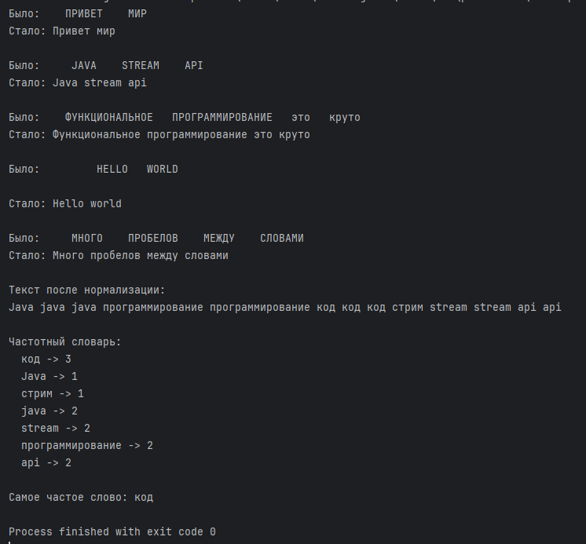
</details>

<br>
<br>

---

## Часть 8: Интеграционное задание

### <a id="title15">Задание 8.1: Система управления библиотекой</a>

Создайте файл LibrarySystem.java — полноценную мини-систему, объединяющую все темы лекции.

Требования:

1. enum Genre — жанры книг: FICTION, SCIENCE, HISTORY, PROGRAMMING, ART. Каждый жанр имеет поле String russianName. Метод static Genre fromString(String name) — находит жанр по русскому названию.

2. record Book(String title, String author, int year, Genre genre, double price) — с компактным конструктором:

* title и author не пустые

* year от 1450 до текущего года

* price >= 0

3. sealed interface LibraryItem permits PhysicalBook, EBook — с методом String getInfo():

* record PhysicalBook(Book book, String shelf) implements LibraryItem

* record EBook(Book book, String format, double sizeMB) implements LibraryItem

4. interface Searchable — с default-методом boolean matches(String query) и static-методом static <T extends Searchable> List<T> search(List<T> items, String query)

5. Класс Library:

* Хранит список LibraryItem

* Метод void add(LibraryItem item)

* Метод void printCatalog() — выводит все книги, используя паттерн-матчинг switch для LibraryItem

* Метод Map<Genre, List<LibraryItem>> groupByGenre() — группирует через EnumMap и Stream API

* Метод double totalValue() — общая стоимость через stream + reduce

* Метод Optional<LibraryItem> mostExpensive() — самая дорогая книга

* Метод List<String> authorsByGenre(Genre genre) — уникальные авторы жанра, отсортированные по алфавиту

В main: создайте библиотеку с 8+ книгами (физические и электронные), продемонстрируйте все методы.

#### Решение

```
package practice_2.task_8_1;

import java.util.*;
import java.util.stream.Collectors;

public class LibrarySystem {

    // 1. Enum Genre
    public enum Genre {
        FICTION("Художественная литература"),
        SCIENCE("Наука"),
        HISTORY("История"),
        PROGRAMMING("Программирование"),
        ART("Искусство");

        private final String russianName;

        Genre(String russianName) {
            this.russianName = russianName;
        }

        public String getRussianName() {
            return russianName;
        }

        public static Genre fromString(String name) {
            for (Genre g : Genre.values()) {
                if (g.russianName.equalsIgnoreCase(name) || g.name().equalsIgnoreCase(name)) {
                    return g;
                }
            }
            throw new IllegalArgumentException("Неизвестный жанр: " + name);
        }
    }

    // 2. Record Book
    public record Book(String title, String author, int year, Genre genre, double price) {
        public Book {
            if (title == null || title.isBlank()) {
                throw new IllegalArgumentException("Название книги не может быть пустым");
            }
            if (author == null || author.isBlank()) {
                throw new IllegalArgumentException("Автор не может быть пустым");
            }
            int currentYear = java.time.Year.now().getValue();
            if (year < 1450 || year > currentYear) {
                throw new IllegalArgumentException("Год должен быть между 1450 и " + currentYear);
            }
            if (price < 0) {
                throw new IllegalArgumentException("Цена не может быть отрицательной");
            }
        }

        @Override
        public String toString() {
            return String.format("\"%s\" - %s (%d г., %s) - %.2f руб.",
                    title, author, year, genre.getRussianName(), price);
        }
    }

    // 3. Sealed interface и records
    public sealed interface LibraryItem permits PhysicalBook, EBook {
        String getInfo();
        Book getBook();
    }

    public record PhysicalBook(Book book, String shelf) implements LibraryItem {
        @Override
        public String getInfo() {
            return String.format("[Физическая] %s | Полка: %s", book, shelf);
        }

        @Override
        public Book getBook() {
            return book;
        }
    }

    public record EBook(Book book, String format, double sizeMB) implements LibraryItem {
        @Override
        public String getInfo() {
            return String.format("[Электронная] %s | Формат: %s, Размер: %.2f MB",
                    book, format, sizeMB);
        }

        @Override
        public Book getBook() {
            return book;
        }
    }

    // 4. Interface Searchable
    public interface Searchable {
        default boolean matches(String query) {
            if (query == null || query.isBlank()) return false;
            String lowerQuery = query.toLowerCase();
            return getSearchableText().toLowerCase().contains(lowerQuery);
        }

        String getSearchableText();

        static <T extends Searchable> List<T> search(List<T> items, String query) {
            return items.stream()
                    .filter(item -> item.matches(query))
                    .collect(Collectors.toList());
        }
    }

    // 5. Класс Library
    public static class Library {
        private final List<LibraryItem> items = new ArrayList<>();

        public void add(LibraryItem item) {
            items.add(item);
        }

        public void printCatalog() {
            for (LibraryItem item : items) {
                // Pattern matching switch
                switch (item) {
                    case PhysicalBook pb -> System.out.println("  ? " + pb.getInfo());
                    case EBook eb -> System.out.println("  ? " + eb.getInfo());
                }
            }
            System.out.println();
        }

        public Map<Genre, List<LibraryItem>> groupByGenre() {
            return items.stream()
                    .collect(Collectors.groupingBy(
                            item -> item.getBook().genre(),
                            () -> new EnumMap<>(Genre.class),
                            Collectors.toList()
                    ));
        }

        public double totalValue() {
            return items.stream()
                    .map(item -> item.getBook().price())
                    .reduce(0.0, Double::sum);
        }

        public Optional<LibraryItem> mostExpensive() {
            return items.stream()
                    .max(Comparator.comparing(item -> item.getBook().price()));
        }

        public List<String> authorsByGenre(Genre genre) {
            return items.stream()
                    .filter(item -> item.getBook().genre() == genre)
                    .map(item -> item.getBook().author())
                    .distinct()
                    .sorted()
                    .collect(Collectors.toList());
        }

        public void printGroupedByGenre() {
            Map<Genre, List<LibraryItem>> grouped = groupByGenre();
            grouped.forEach((genre, itemList) -> {
                System.out.println(genre.getRussianName() + ":");
                itemList.forEach(item -> System.out.println("  - " + item.getBook().title()));
            });
            System.out.println();
        }

        public void printStatistics() {
            System.out.printf("Всего книг: %d%n", items.size());
            System.out.printf("Общая стоимость: %.2f руб.%n", totalValue());

            mostExpensive().ifPresent(item -> {
                System.out.println("Самая дорогая книга:");
                System.out.println("  " + item.getInfo());
            });

            System.out.printf("Средняя цена: %.2f руб.%n",
                    items.stream().mapToDouble(item -> item.getBook().price()).average().orElse(0));
            System.out.println();
        }
    }

    // Делаем LibraryItem поисковым
    public static class SearchableLibraryItem implements Searchable {
        private final LibraryItem item;

        public SearchableLibraryItem(LibraryItem item) {
            this.item = item;
        }

        @Override
        public String getSearchableText() {
            Book b = item.getBook();
            return b.title() + " " + b.author() + " " + b.genre().getRussianName();
        }

        public LibraryItem getItem() {
            return item;
        }
    }

    public static void main(String[] args) {

        // Создаём библиотеку
        Library library = new Library();

        // Добавляем физические книги
        library.add(new PhysicalBook(
                new Book("Война и мир", "Лев Толстой", 1869, Genre.FICTION, 1200.50),
                "A-1"
        ));

        library.add(new PhysicalBook(
                new Book("Преступление и наказание", "Фёдор Достоевский", 1866, Genre.FICTION, 950.00),
                "A-2"
        ));

        library.add(new PhysicalBook(
                new Book("Краткая история времени", "Стивен Хокинг", 1988, Genre.SCIENCE, 1500.00),
                "B-3"
        ));

        library.add(new PhysicalBook(
                new Book("SPQR. История Древнего Рима", "Мэри Бирд", 2015, Genre.HISTORY, 1800.00),
                "C-1"
        ));

        library.add(new PhysicalBook(
                new Book("Clean Code", "Роберт Мартин", 2008, Genre.PROGRAMMING, 2500.00),
                "D-5"
        ));

        // Добавляем электронные книги
        library.add(new EBook(
                new Book("Java. Эффективное программирование", "Джошуа Блох", 2018, Genre.PROGRAMMING, 1800.00),
                "PDF", 15.5
        ));

        library.add(new EBook(
                new Book("Искусство цвета", "Иоханнес Иттен", 1961, Genre.ART, 2200.00),
                "EPUB", 45.2
        ));

        library.add(new EBook(
                new Book("Структура научных революций", "Томас Кун", 1962, Genre.SCIENCE, 1100.00),
                "MOBI", 2.8
        ));

        library.add(new EBook(
                new Book("Мастер и Маргарита", "Михаил Булгаков", 1967, Genre.FICTION, 800.00),
                "FB2", 1.5
        ));

        // Демонстрация работы
        library.printCatalog();
        library.printStatistics();
        library.printGroupedByGenre();

        // Авторы по жанрам
        for (Genre g : Genre.values()) {
            List<String> authors = library.authorsByGenre(g);
            if (!authors.isEmpty()) {
                System.out.println(g.getRussianName() + ": " + String.join(", ", authors));
            }
        }
        System.out.println();

        // Демонстрация поиска
        List<SearchableLibraryItem> searchableItems = library.items.stream()
                .map(SearchableLibraryItem::new)
                .collect(Collectors.toList());

        String[] queries = {"Java", "история", "Толстой"};
        for (String query : queries) {
            System.out.println("Поиск по запросу: \"" + query + "\"");
            List<SearchableLibraryItem> found = Searchable.search(searchableItems, query);
            found.forEach(item -> System.out.println("  - " + item.getItem().getBook().title()));
            System.out.println();
        }

        // Проверка метода fromString
        System.out.println("Поиск жанра 'Программирование': " +
                Genre.fromString("Программирование"));
        System.out.println("Поиск жанра 'FICTION': " +
                Genre.fromString("FICTION"));
        System.out.println();
    }
}
```

<details>
    <summary>result</summary>
    
</details>
